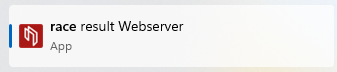
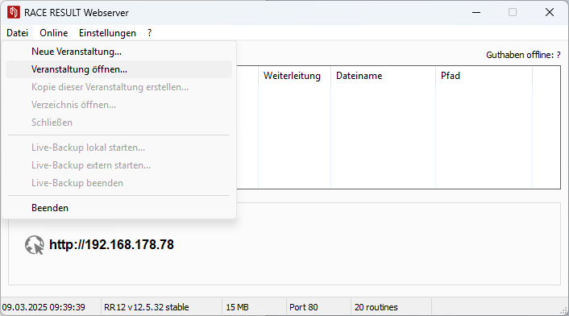
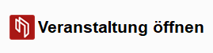
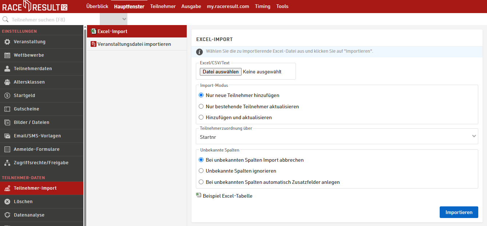
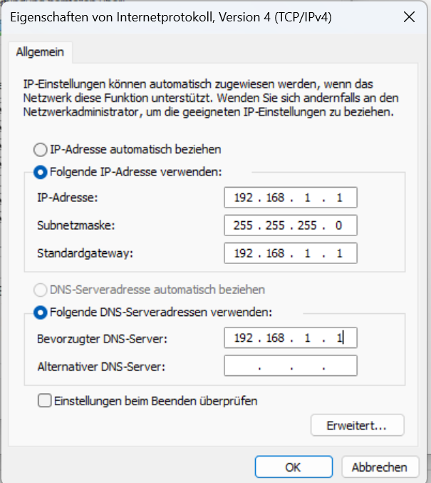
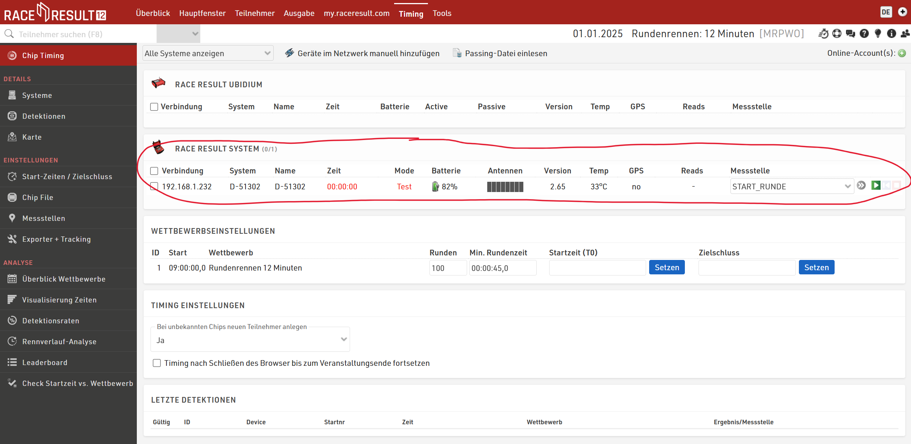
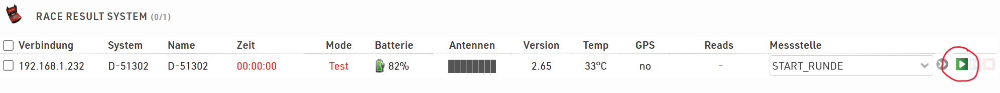
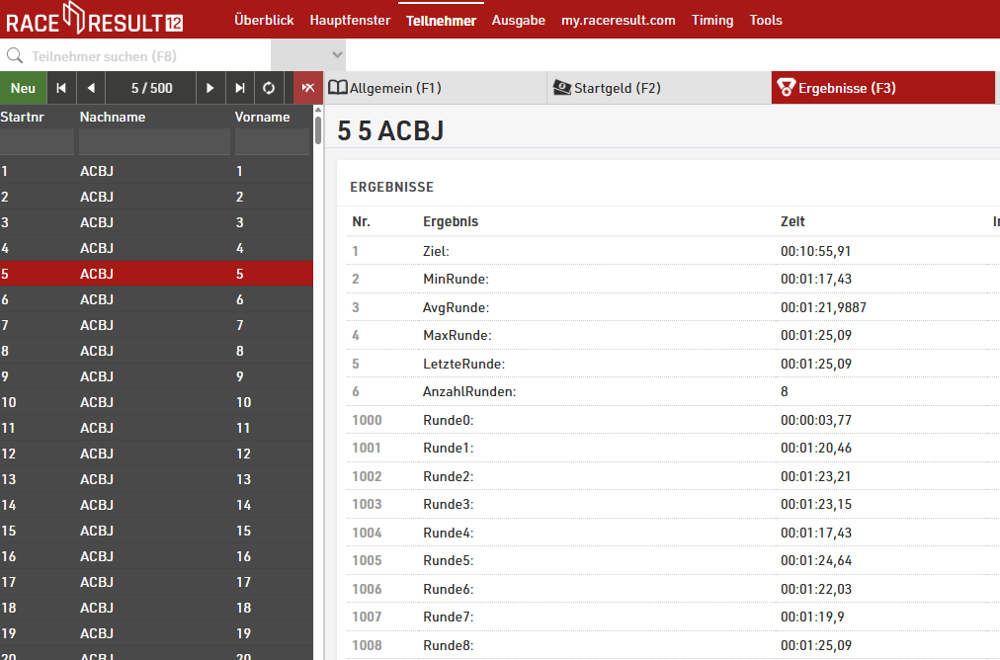
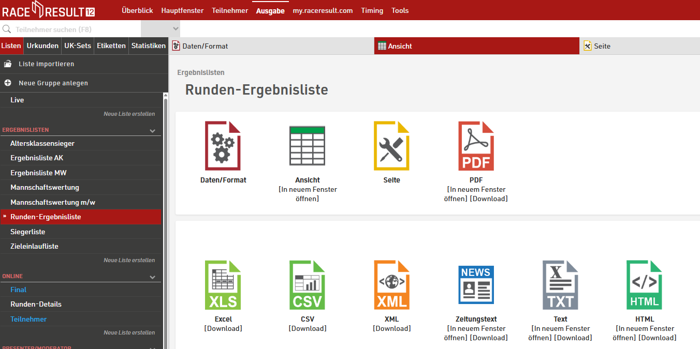

# RACE RESULT Tutorial

## Installation

- Download Link: https://www.raceresult.com/de/software/download
- Im Tutorial genutzte Version: 12.5.32 (64-bit)
- den Installationsanweisungen folgen

## Wettkampfkonfigurationen

- Zeiten werden nur an der einen Start-/Ziellinie gemessen
- Für einige Laufstrecken (z. B. 1000m) bedeutet das, dass der Start der Zeitmessung per Knopfdruck am Decoder ausgelöst werden muss

### 100m
- Konfigurationsdatei: [configs/100m.ses](configs/100m.ses)
- Startaufstellung: Startlinie
- Bodenantenne: Ziellinie

### 800m
- Konfigurationsdatei: [configs/800m.ses](configs/800m.ses)
- Startaufstellung: 10m vor der Start-/Ziellinie
  - erste Überquerung der Start-/Ziellinie ist Nettostartzeit
  - zweite Überquerung der Start-/Ziellinie ist 400m Zeit
  - dritte Überquerung der Start-/Ziellinie ist 800m Zeit

### 1000m
- Konfigurationsdatei: [configs/1000m.ses](configs/1000m.ses)
- Startaufstellung: Startlinie
- Bodenantenne: 200m entfernt
  - erste Überquerung der Ziellinie ist 200m Zeit
  - zweite Überquerung der Ziellinie ist 600m Zeit
  - dritte Überquerung der Ziellinie ist 1000m Zeit

### 12 Min- / 30 Min- / 45 Min-Rennen (Rundenanzahl)
- Konfigurationsdatei: [configs/Rundenlauf.ses](configs/Rundenlauf.ses)
- Startaufstellung: 10m vor der Start-/Ziellinie
  - erste Überquerung der Start-/Ziellinie ist Runde 0

## Wettkampfdurchführung
- Race Result Webserver starten: 
  
- Veranstaltung öffnen: 
  
- Verwaltung im Browser öffnen: 
   
- Teilnehmerdaten laden (siehe [generische Transponderteilnehmerliste](configs/Teilnehmerliste.xlsx)) 
  
- Verbindung mit Decoder herstellen
  - Optional: Decoder an eine Stromquelle anschließen
  - Start-/Ziellinie mit 8 Kabeln mit dem Decoder verbinden
  - Decoder und Notebook mit LAN Kabel verbinden
  - Decoder anschalten ("ON")
  - Netzwerkeinstellungen: 
    
  - Decoder sollte im Bereich "Timing" erscheinen: 
    
  - Zeiterfassung starten: 
    
  - Startschuss: zeitgleich Zeitmessung am Decoder auslösen ("Start")
    - Bruttozeit ist am Decoder ersichtlich
  - Nach dem Lauf:
    - Zeitnahme beenden: Am Decoder: "MENU" -> "OK" -> "Pfeil nach unten" -> "OK"
    - Ab diesem Zeitpunkt werden keine Runden mehr gezählt!
  - Ergebnisse abrufen:
    - Im Menüpunkt "Teilnehmer" -> "Ergebnisse": 
      
    - Im Menüpunkt "Ausgabe" -> "Rundenergebnislisten" 
      
